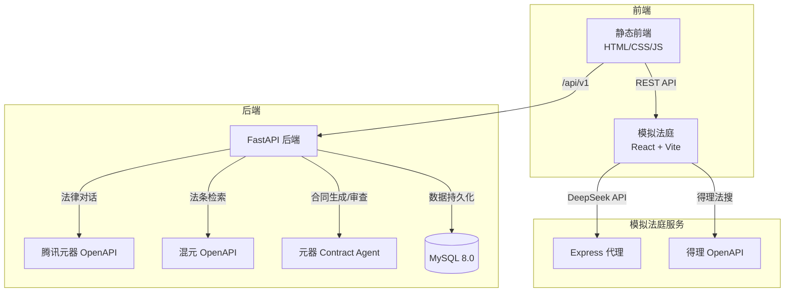

# 律智助手 — AI 法律服务平台

<p align="center">
  
  
  
  
  
</p>

<p align="center">
  <strong>AI 驱动的法律对话 · 法条检索 · 合同生成/审查 · 模拟法庭预演</strong>
</p>

---

## 功能特性

| 功能 | 说明 | 技术亮点 |
|------|------|----------|
| 法律对话 | 基于大模型的智能法律问答 | 腾讯元器 / 混元 OpenAPI，流式响应 |
| 法条检索 | 精准检索法律条文与案例 | 腾讯混元 OpenAPI 托管知识库 |
| 合同生成 | 15 种合同模板，AI 自动起草 | 多 Agent 协作，结构化输出 |
| 合同审查 | 上传合同，AI 识别风险点 | 文档解析 + 风险分级 |
| 模拟法庭 | AI 模拟庭审辩论预演 | DeepSeek + 得理法搜 + React 前端 |

## 系统架构



> 说明：法条检索功能使用腾讯混元平台的托管知识库实现 RAG，不在此仓库内自建向量检索链路。

## 快速启动

### 方式一：Docker 一键启动（推荐）

```bash
git clone https://github.com/yara1006/lvzhi_assistant.git
cd lvzhi_assistant
cp .env.example .env
# 编辑 .env 填入你的 API Key
docker-compose up -d
```

启动后访问：
- 前端：http://localhost:3000
- 后端 API：http://localhost:8000
- API 文档：http://localhost:8000/docs

### 方式二：本地开发

```bash
# 1. 初始化数据库
mysql -u root -p < sql/init.sql

# 2. 启动后端
cd backend
python -m venv .venv && source .venv/bin/activate
pip install -e .
cp ../.env.example .env  # 编辑填入 API Key
uvicorn app.main:app --reload --port 8000

# 3. 启动前端
cd frontend
python -m http.server 3000

# 4. 启动模拟法庭（可选）
cd court-rehearsal
npm install && npm run dev
```

### 方式三：Makefile

```bash
make install     # 安装依赖
make dev         # 启动后端
make test        # 运行测试
make docker-up   # Docker 启动全部服务
```

## 项目结构

```text
lvzhi_assistant/
├── backend/                  # FastAPI 核心后端
│   ├── app/
│   │   ├── api/v1/           # 版本化 API 路由
│   │   ├── core/             # 配置、异常处理、日志
│   │   ├── db/               # SQLAlchemy ORM 模型
│   │   ├── services/         # 业务服务层
│   │   └── schemas/          # Pydantic 数据模型
│   ├── tests/                # pytest 测试套件
│   └── Dockerfile
├── frontend/                 # 静态前端（HTML/CSS/JS）
├── court-rehearsal/          # 模拟法庭（React + Vite）
── sql/
│   └── init.sql              # 数据库初始化脚本
├── docker-compose.yml        # 一键部署
├── Makefile
├── LICENSE
└── README.md
```

## 测试

```bash
cd backend
pytest -v
```

测试使用内存 SQLite 和 Mock 配置，不需要连接真实 MySQL 或外部 API。

## 环境变量

| 变量 | 必填 | 说明 |
|------|------|------|
| `DATABASE_URL` | 是 | MySQL 异步连接串 |
| `JWT_SECRET` | 是 | JWT 签名密钥 |
| `YUANQI_API_KEY` | 是 | 腾讯元器 API Key |
| `YUANQI_ASSISTANT_ID` | 是 | 默认元器智能体 ID |
| `HUNYUAN_API_KEY` | 否 | 混元 OpenAPI Key（法条检索备用） |
| `CORS_ORIGINS` | 否 | 允许的跨域来源，逗号分隔 |
| `DEBUG` | 否 | 是否启用调试模式，默认 false |
| `FRONTEND_PATH` | 否 | 前端静态文件路径，默认自动检测 |

完整变量列表见 `.env.example`。

## 贡献

欢迎提交 Issue 和 Pull Request。详见 [CONTRIBUTING.md](CONTRIBUTING.md)。

## License

[MIT](LICENSE)
