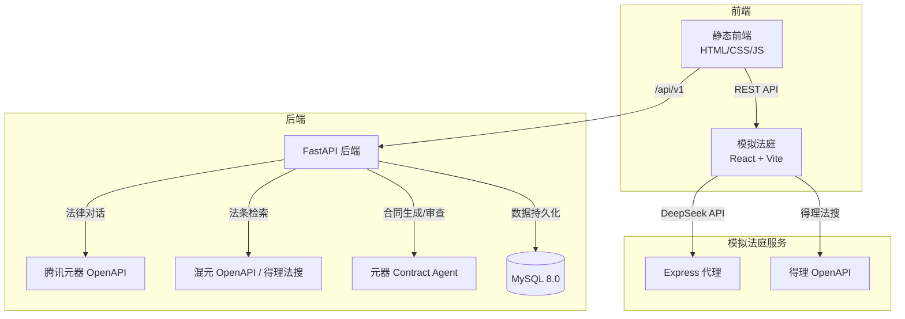

# 律智助手项目修缮清单

> 本文档为代码修改指令清单，可直接交给 AI 编程工具（Codex / Claude）逐条执行。
> 修改完成后请运行 `pytest` 确保测试通过，然后 commit & push。

---

## 🔴 P0：安全漏洞修复（必须立即修复）

### 1. 删除硬编码 API 密钥

**文件：** `court-rehearsal-ai/server/index.js`

**第 31-32 行，当前代码：**
```javascript
const DELI_APPID = process.env.DELI_APPID || 'QthdBErlyaYvyXul';
const DELI_SECRET = process.env.DELI_SECRET || 'EC5D455E6BD348CE8E18BE05926D2EBE';
```

**修改为：**
```javascript
const DELI_APPID = process.env.DELI_APPID;
const DELI_SECRET = process.env.DELI_SECRET;
```

**同时在文件顶部（配置区域之后）添加启动检查：**
```javascript
if (!DELI_APPID || !DELI_SECRET) {
  console.error('Error: DELI_APPID and DELI_SECRET must be set in environment variables');
  process.exit(1);
}
```

---

### 2. 修复 CORS 配置

**文件：** `Legal_Assistant/app/main.py`

**第 40-46 行，当前代码：**
```python
app.add_middleware(
    CORSMiddleware,
    allow_origins=["*"],
    allow_credentials=True,
    allow_methods=["*"],
    allow_headers=["*"],
)
```

**修改为：**
```python
app.add_middleware(
    CORSMiddleware,
    allow_origins=settings.cors_origin_list,
    allow_credentials=True,
    allow_methods=["GET", "POST", "PUT", "DELETE", "OPTIONS"],
    allow_headers=["Authorization", "Content-Type", "X-Request-ID"],
)
```

---

### 3. 删除所有硬编码服务器 IP

**文件 ①：** `Frontend/js/tools.js`

**第 30 行，当前代码：**
```javascript
window.open('http://42.193.138.163:8001', '_blank');
```

**修改为：**
```javascript
const courtUrl = window.YUANQI_CONFIG?.COURT_URL || '/court';
window.open(courtUrl, '_blank');
```

**文件 ②：** `Frontend/js/chat.js`

**第 422 行，当前代码：**
```javascript
const response = await fetch('http://localhost:8001/api/moot/court', {
```

**修改为：**
```javascript
const courtBaseUrl = window.YUANQI_CONFIG?.COURT_API || '/court-api';
const response = await fetch(`${courtBaseUrl}/api/moot/court`, {
```

**文件 ③：** `Frontend/config.js`

**第 7 行，删除注释掉的 IP 地址行：**
```javascript
// 删除这行：
// API_BASE: 'http://42.193.138.163:8000/api/v1',
```

---

### 4. 删除泄露 API Key 的 print 语句

**文件 ①：** `Legal_Assistant/app/services/yuanqi_client.py`

**第 65-69 行，删除以下 5 行：**
```python
print(f"=== REQUEST DEBUG ===")
print(f"URL: {url}")
print(f"Headers: {self._headers(api_key=api_key)}")
print(f"Payload: {payload}")
print(f"===================")
```

**文件 ②：** `Legal_Assistant/app/api/v1/contract.py`

**第 403-408 行，删除以下 6 行：**
```python
print(f"=== DEBUG contract_generate ===")
print(f"assistant_id: {assistant_id}")
print(f"user_id: {user_id}")
print(f"api_key: {settings.yuanqi_api_key_for('contract_generate')}")
print(f"messages: {messages}")
print(f"=== 调试结束 ===")
```

---

### 5. 修复前端 XSS 风险

**文件 ①：** `Frontend/js/chat.js`

**第 366 行，`appendBubble` 函数，当前代码：**
```javascript
div.innerHTML = `...<div class="msg-bubble">${m.content}</div>...</div>`;
```

**问题：** `m.content` 未经转义直接插入 innerHTML，存在 XSS 风险。

**修改为：**
```javascript
div.innerHTML = `...<div class="msg-bubble">${esc(m.content)}</div>...</div>`;
```

**文件 ②：** `Frontend/js/chat.js`

**第 828 行，`renderHistoryFromServer` 函数中的 onclick 拼接，当前代码：**
```javascript
onclick="onHistoryItemClick(event, '${s.id}', '${esc(s.title)}')"
```

**问题：** `s.id` 是 UUID 未经转义直接拼入 onclick 属性。

**修改为：**
```javascript
onclick="onHistoryItemClick(event, '${esc(s.id)}', '${esc(s.title)}')"
```

---

### 6. 修复硬编码前端路径

**文件：** `Legal_Assistant/app/main.py`

**第 65 行，当前代码：**
```python
frontend_path = "/home/ubuntu/Frontend"
```

**问题：** 硬编码服务器绝对路径，本地开发和其他部署环境无法使用。

**修改为：**
```python
frontend_path = os.environ.get("FRONTEND_PATH", os.path.join(os.path.dirname(os.path.dirname(os.path.dirname(__file__))), "Frontend"))
```

**第 79 行，当前代码：**
```python
app.mount("/config.js", StaticFiles(directory=frontend_path), name="config")
```

**问题：** 把整个 frontend 目录挂载到了 `/config.js` 路径下，应该挂载单个文件。

**修改为：**
```python
@app.get("/config.js")
async def serve_config():
    return FileResponse(os.path.join(frontend_path, "config.js"))
```

---

## 🟡 P1：代码质量修复

### 7. 添加缺失的 python-docx 依赖

**文件：** `Legal_Assistant/pyproject.toml`

**在 dependencies 列表中添加（第 24 行之后）：**
```toml
dependencies = [
    "fastapi>=0.115.0",
    "uvicorn[standard]>=0.32.0",
    "pydantic-settings>=2.6.0",
    "httpx>=0.27.0",
    "sqlalchemy[asyncio]>=2.0.36",
    "asyncmy>=0.2.9",
    "alembic>=1.14.0",
    "python-jose[cryptography]>=3.3.0",
    "python-multipart>=0.0.12",
    "python-docx>=1.1.0",
]
```

---

### 8. 删除所有调试 print 语句

以下文件中的 print 语句全部删除或替换为 `logging` 调用：

**文件 ①：** `Legal_Assistant/app/api/v1/auth.py`
- **第 62 行：** 删除 `print(f"验证码发送到 {body.phone}: {code}")`

**文件 ②：** `Legal_Assistant/app/api/v1/contract.py`
- **第 167 行：** 删除 `print(f"自动创建审查会话: {actual_session_id}")`
- **第 365 行：** 删除 `print(f"自动创建合同生成会话: {actual_session_id}")`

**文件 ③：** `Legal_Assistant/app/api/v1/legal_search.py`
- **第 66 行：** 删除 `print(f"自动创建法条检索会话: {actual_session_id}")`

**文件 ④：** `Legal_Assistant/app/services/session_utils.py`
- **第 55 行：** 删除 `print(f"自动创建会话: {actual_session_id}, tool_type={tool_type}")`
- **第 78 行：** 将 `print(f"保存用户消息失败: {e}")` 替换为 `logger.error(f"保存用户消息失败: {e}")`
- **第 100 行：** 将 `print(f"保存AI回复失败: {e}")` 替换为 `logger.error(f"保存AI回复失败: {e}")`
- **第 117 行：** 删除 `print(f"更新会话标题: {new_title[:50]}")`
- **第 119 行：** 将 `print(f"更新会话标题失败: {e}")` 替换为 `logger.error(f"更新会话标题失败: {e}")`

> 注意：对于使用 logger 替换的 print，确保文件顶部有 `import logging` 和 `logger = logging.getLogger(__name__)`

---

### 9. 消除重复代码 — `_ensure_session_owned`

该函数在 3 个文件中重复定义：
- `Legal_Assistant/app/api/v1/contract.py` 第 52-66 行
- `Legal_Assistant/app/api/v1/legal_search.py` 第 23-37 行
- `Legal_Assistant/app/services/session_utils.py` 第 12-27 行（已有公共版本 `ensure_session_owned`）

**操作：**

1. **保留** `session_utils.py` 中的 `ensure_session_owned`（公共版本，无下划线前缀）

2. **删除** `contract.py` 中的 `_ensure_session_owned` 函数定义（第 52-66 行），并在文件顶部添加导入：
   ```python
   from app.services.session_utils import ensure_session_owned
   ```
   将文件中所有 `_ensure_session_owned(...)` 调用替换为 `ensure_session_owned(...)`

3. **删除** `legal_search.py` 中的 `_ensure_session_owned` 函数定义（第 23-37 行），并在文件顶部添加导入：
   ```python
   from app.services.session_utils import ensure_session_owned
   ```
   将文件中所有 `_ensure_session_owned(...)` 调用替换为 `ensure_session_owned(...)`

---

### 10. 删除 .bak 文件和 dist/ 构建产物

**删除以下文件：**
```
Frontend/index.html.bak
Frontend/js/chat.js.bak
Frontend/js/chat.js.bak2
Frontend/js/chat.js.bak3
```

**删除以下目录：**
```
court-rehearsal-ai/dist/
```

**更新根目录 `.gitignore`，添加以下行：**
```
*.bak
*.bak2
*.bak3
dist/
```

---

### 11. 验证码安全加固

**文件：** `Legal_Assistant/app/api/v1/auth.py`

**修改 `_dev_codes` 存储结构，添加过期时间（第 44 行附近）：**

当前：
```python
_dev_codes = {}
```

修改为：
```python
import time
_dev_codes = {}  # {phone: {"code": "123456", "expires": timestamp}}
CODE_EXPIRE_SECONDS = 300  # 5 分钟过期
```

**修改 `send_code` 函数中验证码存储逻辑（第 60 行附近）：**

当前：
```python
_dev_codes[body.phone] = code
```

修改为：
```python
_dev_codes[body.phone] = {
    "code": code,
    "expires": time.time() + CODE_EXPIRE_SECONDS
}
```

**修改 `login` 函数中验证码验证逻辑（找到验证码校验的位置）：**

当前类似：
```python
stored = _dev_codes.get(body.phone)
if stored != body.code:
    raise AppError(...)
```

修改为：
```python
stored = _dev_codes.get(body.phone)
if not stored:
    raise AppError("code_invalid", "验证码不存在或已过期", status_code=400)
if time.time() > stored["expires"]:
    del _dev_codes[body.phone]
    raise AppError("code_expired", "验证码已过期", status_code=400)
if stored["code"] != body.code:
    raise AppError("code_invalid", "验证码错误", status_code=400)
# 验证成功后删除，防止重放
del _dev_codes[body.phone]
```

**在生产环境返回中隐藏 dev_code（第 65-69 行）：**

当前：
```python
return {
    "message": "验证码已发送",
    "phone": body.phone,
    "dev_code": code
}
```

修改为：
```python
import os
resp = {
    "message": "验证码已发送",
    "phone": body.phone,
}
# 仅在开发环境返回验证码，方便调试
if os.getenv("ENV", "production") == "development":
    resp["dev_code"] = code
return resp
```

---

### 12. 修复合同下载接口的安全问题

**文件：** `Frontend/js/tools.js`

**第 269 行，当前代码：**
```javascript
const res = await fetch(`/api/v1/contracts/download/${contractId}?user_id=${userId}`, {
```

**问题：** `user_id` 通过 URL query 参数传递，可以被篡改。

**修改为：**
```javascript
const res = await fetch(`/api/v1/contracts/download/${contractId}`, {
```

> 后端应该从 JWT token 中提取 user_id，而不是从 query 参数。如果后端当前依赖 query 参数中的 user_id，需要同步修改后端接口，从 `request.user` 或 JWT 中获取。

---

### 13. 清理前端冗余 console.log

**文件：** `Frontend/js/chat.js` — 删除以下冗余 console.log：
- 第 17 行：`console.log('选择工具:', toolType);`
- 第 19 行：`console.log('已在当前工具，无需切换');`
- 第 35 行：`console.log(\`工具已从...切换到...\`);`
- 第 45 行：`console.log('模拟法庭：将调用独立服务端口 8001');`
- 第 54 行：`console.log('newChat 跳过：正在创建会话中');`
- 第 58 行：`console.log('newChat 被调用');`
- 第 68 行：`console.log('发现已有空会话，直接使用:'...);`
- 第 114 行：`console.log('后端会话已创建并更新本地ID:'...);`

保留 `console.error` 用于错误追踪。

**文件：** `Frontend/js/tools.js` — 删除以下冗余 console.log：
- 第 27 行：`console.log('切换到工具:', tool);`
- 第 36 行：`console.log('currentTool 已设置为:'...);`
- 第 121 行：`console.log('已选择合同类型:'...);`
- 第 189 行：`console.log('合同生成 - 类型:'...);`
- 第 208 行：`console.log('调用 API:'...);`
- 第 266 行：`console.log('下载合同:'...);`

---

### 14. 消除前端代码重复 — submitReview / submitReviewByText

**文件：** `Frontend/js/tools.js`

`submitReview`（第 401-485 行）和 `submitReviewByText`（第 487-544 行）中有大段重复代码（发送请求、处理响应、错误处理）。

**操作：** 提取公共函数 `executeReviewRequest`：

```javascript
async function executeReviewRequest(token, payload, isFormData = false) {
  // 切换界面
  const reviewUI = document.getElementById('contractReviewUI');
  const chatView = document.getElementById('chatView');
  if (reviewUI) reviewUI.style.display = 'none';
  if (chatView) chatView.style.display = 'flex';

  if (typeof newChat === 'function') newChat();
  if (typeof appendBubble === 'function') {
    appendBubble({ role: 'assistant', content: '正在分析合同，请稍候...', ts: Date.now() });
  }

  try {
    const fetchOptions = {
      method: 'POST',
      headers: { 'Authorization': `Bearer ${token}` },
    };
    if (isFormData) {
      fetchOptions.body = payload;
    } else {
      fetchOptions.headers['Content-Type'] = 'application/json';
      fetchOptions.body = JSON.stringify(payload);
    }

    const res = await fetch('/api/v1/contracts/review', fetchOptions);
    if (!res.ok) {
      const errorText = await res.text();
      throw new Error(`HTTP ${res.status}: ${errorText}`);
    }

    const data = await res.json();
    const messagesEl = document.getElementById('messages');
    const lastMsg = messagesEl?.lastChild;
    if (lastMsg && lastMsg.textContent.includes('正在分析')) {
      lastMsg.remove();
    }

    const result = data.result || data.message || '审查完成';
    if (typeof appendBubble === 'function') {
      appendBubble({ role: 'assistant', content: result, ts: Date.now() });
    }
  } catch (err) {
    console.error('审查失败:', err);
    const messagesEl = document.getElementById('messages');
    const lastMsg = messagesEl?.lastChild;
    if (lastMsg && lastMsg.textContent.includes('正在分析')) {
      lastMsg.remove();
    }
    if (typeof appendBubble === 'function') {
      appendBubble({ role: 'assistant', content: `审查失败：${err.message}`, ts: Date.now() });
    }
  }
}
```

然后 `submitReview` 和 `submitReviewByText` 分别调用这个公共函数。

---

## 🟢 P2：锦上添花（有余力再做）

### 15. 添加 LICENSE 文件

在根目录创建 `LICENSE` 文件，使用 MIT 协议：

```
MIT License

Copyright (c) 2026 yara1006

Permission is hereby granted, free of charge, to any person obtaining a copy
of this software and associated documentation files (the "Software"), to deal
in the Software without restriction, including without limitation the rights
to use, copy, modify, merge, publish, distribute, sublicense, and/or sell
copies of the Software, and to permit persons to whom the Software is
furnished to do so, subject to the following conditions:

The above copyright notice and this permission notice shall be included in all
copies or substantial portions of the Software.

THE SOFTWARE IS PROVIDED "AS IS", WITHOUT WARRANTY OF ANY KIND, EXPRESS OR
IMPLIED, INCLUDING BUT NOT LIMITED TO THE WARRANTIES OF MERCHANTABILITY,
FITNESS FOR A PARTICULAR PURPOSE AND NONINFRINGEMENT. IN NO EVENT SHALL THE
AUTHORS OR COPYRIGHT HOLDERS BE LIABLE FOR ANY CLAIM, DAMAGES OR OTHER
LIABILITY, WHETHER IN AN ACTION OF CONTRACT, TORT OR OTHERWISE, ARISING FROM,
OUT OF OR IN CONNECTION WITH THE SOFTWARE OR THE USE OR OTHER DEALINGS IN THE
SOFTWARE.
```

---

### 16. 添加 GitHub Actions CI

创建文件 `.github/workflows/ci.yml`：

```yaml
name: CI

on:
  push:
    branches: [main, master]
  pull_request:
    branches: [main, master]

jobs:
  test:
    runs-on: ubuntu-latest
    strategy:
      matrix:
        python-version: ["3.11", "3.12"]

    steps:
      - uses: actions/checkout@v4

      - name: Set up Python ${{ matrix.python-version }}
        uses: actions/setup-python@v5
        with:
          python-version: ${{ matrix.python-version }}

      - name: Install dependencies
        working-directory: Legal_Assistant
        run: |
          pip install -e ".[dev]" || pip install -e .
          pip install pytest pytest-asyncio respx httpx aiosqlite

      - name: Run tests
        working-directory: Legal_Assistant
        env:
          ENV: test
          DATABASE_URL: sqlite+aiosqlite:///./test.db
          JWT_SECRET: test-secret
        run: pytest -v
```

---

### 17. 更新 README.md

**文件：** 根目录 `README.md`

**删除第 199-202 行关于 .bak 和 dist 的过时说明：**
```markdown
- `Frontend` 目录中保留了若干 `.bak` 备份文件，当前没有参与运行主流程。
- `court-rehearsal-ai/dist` 是已构建产物，源码入口仍以 `index.html` 和 Vite 配置为准。
```

**在"部署建议"部分添加环境变量 `FRONTEND_PATH` 的说明。**

---

### 18. 添加认证接口 Rate Limiting

**文件：** `Legal_Assistant/app/api/v1/auth.py`

在 `send_code` 和 `login` 路由上添加简单的频率限制，防止暴力破解验证码：

```python
from collections import defaultdict
import time

_rate_limit_store = defaultdict(list)
RATE_LIMIT_WINDOW = 60  # 秒
RATE_LIMIT_MAX = 5  # 每分钟最多 5 次

def _check_rate_limit(key: str):
    now = time.time()
    _rate_limit_store[key] = [t for t in _rate_limit_store[key] if now - t < RATE_LIMIT_WINDOW]
    if len(_rate_limit_store[key]) >= RATE_LIMIT_MAX:
        raise AppError("rate_limited", "请求过于频繁，请稍后再试", status_code=429)
    _rate_limit_store[key].append(now)
```

在 `send_code` 和 `login` 函数开头调用：
```python
_check_rate_limit(body.phone)
```

---

### 19. 添加 .editorconfig

在根目录创建 `.editorconfig`：

```ini
root = true

[*]
indent_style = space
indent_size = 2
end_of_line = lf
charset = utf-8
trim_trailing_whitespace = true
insert_final_newline = true

[*.py]
indent_size = 4

[*.md]
trim_trailing_whitespace = false
```

---

## 🔵 P3：项目包装与工程化（让仓库像高星项目）

### 20. 添加 Docker Compose 一键启动

在根目录创建 `docker-compose.yml`：

```yaml
version: "3.8"

services:
  db:
    image: mysql:8.0
    container_name: lvzhi_db
    restart: unless-stopped
    environment:
      MYSQL_ROOT_PASSWORD: ${DB_ROOT_PASSWORD:-lvzhi123}
      MYSQL_DATABASE: luzhi_assistant
      MYSQL_CHARSET: utf8mb4
    ports:
      - "3306:3306"
    volumes:
      - ./luzhi_db.sql:/docker-entrypoint-initdb.d/init.sql
      - db_data:/var/lib/mysql
    healthcheck:
      test: ["CMD", "mysqladmin", "ping", "-h", "localhost"]
      interval: 10s
      timeout: 5s
      retries: 5

  api:
    build:
      context: ./Legal_Assistant
      dockerfile: Dockerfile
    container_name: lvzhi_api
    restart: unless-stopped
    ports:
      - "8000:8000"
    environment:
      DATABASE_URL: mysql+asyncmy://root:${DB_ROOT_PASSWORD:-lvzhi123}@db:3306/luzhi_assistant?charset=utf8mb4
      JWT_SECRET: ${JWT_SECRET:-change-me-in-production}
      YUANQI_API_KEY: ${YUANQI_API_KEY:-}
      YUANQI_ASSISTANT_ID: ${YUANQI_ASSISTANT_ID:-}
      CORS_ORIGINS: http://localhost:3000,http://localhost:8000
      FRONTEND_PATH: /app/Frontend
    volumes:
      - ./Frontend:/app/Frontend:ro
    depends_on:
      db:
        condition: service_healthy

  frontend:
    image: python:3.12-slim
    container_name: lvzhi_frontend
    restart: unless-stopped
    ports:
      - "3000:3000"
    working_dir: /app
    volumes:
      - ./Frontend:/app:ro
    command: python -m http.server 3000

volumes:
  db_data:
```

在根目录创建 `.env.example`（Docker 用）：

```bash
# 数据库
DB_ROOT_PASSWORD=lvzhi123

# 后端
JWT_SECRET=change-me-in-production
YUANQI_API_KEY=your-yuanqi-api-key
YUANQI_ASSISTANT_ID=your-assistant-id

# 可选
HUNYUAN_API_KEY=
DEEPSEEK_API_KEY=
DELI_APPID=
DELI_SECRET=
```

更新 README 的快速启动部分，添加 Docker 方式：

```markdown
### Docker 一键启动（推荐）

```bash
cp .env.example .env
# 编辑 .env 填入你的 API Key
docker-compose up -d
```

启动后访问：
- 前端：http://localhost:3000
- 后端 API：http://localhost:8000
- API 文档：http://localhost:8000/docs
```

---

### 21. 添加 Makefile

在根目录创建 `Makefile`：

```makefile
.PHONY: dev test build clean docker-up docker-down lint

# 本地开发
dev:
	@echo "Starting backend..."
	cd Legal_Assistant && uvicorn app.main:app --host 0.0.0.0 --port 8000 --reload

# 运行测试
test:
	cd Legal_Assistant && pytest -v

# Docker 启动
docker-up:
	docker-compose up -d

docker-down:
	docker-compose down

# 清理
clean:
	find . -type d -name __pycache__ -exec rm -rf {} + 2>/dev/null || true
	find . -type f -name "*.pyc" -delete 2>/dev/null || true
	rm -rf Legal_Assistant/.pytest_cache

# 安装依赖
install:
	cd Legal_Assistant && pip install -e ".[dev]"

# 代码检查
lint:
	cd Legal_Assistant && python -m ruff check .
```

---

### 22. 重写 README.md

**完全重写** 根目录 `README.md`，替换全部内容：

````markdown
# 律智助手 — AI 法律服务平台

<p align="center">
  
  
  
  
  
</p>

<p align="center">
  <strong>AI 驱动的法律对话 · 法条检索 · 合同生成/审查 · 模拟法庭预演</strong>
</p>

<p align="center">
  <!-- 替换为你的项目截图 -->
  
</p>

---

## ✨ 功能特性

| 功能 | 说明 | 技术亮点 |
|------|------|----------|
| 💬 法律对话 | 基于大模型的智能法律问答 | 腾讯元器 / 混元 OpenAPI，流式响应 |
| 📜 法条检索 | 精准检索法律条文与案例 | 得理法搜 API + RAG 检索增强 |
| 📝 合同生成 | 15 种合同模板，AI 自动起草 | 多 Agent 协作，结构化输出 |
| 🛡 合同审查 | 上传合同，AI 识别风险点 | 多模态文档理解，风险分级 |
| ⚖️ 模拟法庭 | AI 模拟庭审辩论预演 | DeepSeek + React 前端独立应用 |

## 🏗️ 系统架构



## 🚀 快速启动

### 方式一：Docker 一键启动（推荐）

```bash
git clone https://github.com/yara1006/lvzhi_assistant.git
cd lvzhi_assistant
cp .env.example .env
# 编辑 .env 填入你的 API Key
docker-compose up -d
```

启动后访问：
- 前端：http://localhost:3000
- 后端 API：http://localhost:8000
- API 文档：http://localhost:8000/docs

### 方式二：本地开发

```bash
# 1. 初始化数据库
mysql -u root -p < luzhi_db.sql

# 2. 启动后端
cd Legal_Assistant
python -m venv .venv && source .venv/bin/activate
pip install -e .
cp .env.example .env  # 编辑填入 API Key
uvicorn app.main:app --reload --port 8000

# 3. 启动前端
cd Frontend
python -m http.server 3000

# 4. 启动模拟法庭（可选）
cd court-rehearsal-ai
npm install && npm run dev
```

### 方式三：Makefile

```bash
make install     # 安装依赖
make dev         # 启动后端
make test        # 运行测试
make docker-up   # Docker 启动全部服务
```

## 📁 项目结构

```text
lvzhi_assistant/
├── Frontend/                 # 静态前端（HTML/CSS/JS）
├── Legal_Assistant/          # FastAPI 核心后端
│   ├── app/
│   │   ├── api/v1/           # 版本化 API 路由
│   │   ├── core/             # 配置、异常处理、日志
│   │   ├── db/               # SQLAlchemy ORM 模型
│   │   ├── services/         # 业务服务层
│   │   └── schemas/          # Pydantic 数据模型
│   ├── tests/                # pytest 测试套件
│   └── Dockerfile
├── court-rehearsal-ai/       # 模拟法庭（React + Vite）
├── docker-compose.yml        # 一键部署
├── luzhi_db.sql              # 数据库初始化脚本
└── Makefile
```

## 🧪 测试

```bash
cd Legal_Assistant
pytest -v
```

测试使用内存 SQLite 和 Mock 配置，不需要连接真实 MySQL 或外部 API。

## 🔧 环境变量

| 变量 | 必填 | 说明 |
|------|------|------|
| `DATABASE_URL` | ✅ | MySQL 异步连接串 |
| `JWT_SECRET` | ✅ | JWT 签名密钥 |
| `YUANQI_API_KEY` | ✅ | 腾讯元器 API Key |
| `YUANQI_ASSISTANT_ID` | ✅ | 默认元器智能体 ID |
| `HUNYUAN_API_KEY` | ❌ | 混元 OpenAPI Key（法条检索备用） |
| `CORS_ORIGINS` | ❌ | 允许的跨域来源，逗号分隔 |
| `DEBUG` | ❌ | 是否启用调试模式，默认 false |

完整变量列表见 `Legal_Assistant/.env.example`。

## 📄 License

[MIT](LICENSE)
````

> **重要提示：** README 中引用了 `docs/screenshot-main.png` 截图。用户需要自己截取项目界面截图放入 `docs/` 目录。如果暂时没有截图，可以先删除图片引用行。

---

### 23. 添加项目截图目录

创建 `docs/` 目录，用户需要放入以下截图：

```
docs/
├── screenshot-main.png       # 主界面截图（法律对话）
├── screenshot-law.png        # 法条检索截图
├── screenshot-contract.png   # 合同生成截图
├── screenshot-review.png     # 合同审查截图
└── architecture.png          # 架构图（可选，Mermaid 已在 README 中）
```

> 如果没有截图，可以先创建空目录并添加 `docs/.gitkeep` 文件。

---

### 24. 添加 Contributing Guide

在根目录创建 `CONTRIBUTING.md`：

```markdown
# 贡献指南

感谢你对律智助手项目的关注！

## 开发环境搭建

1. Fork 本仓库并 clone 到本地
2. 安装依赖：`make install`
3. 复制环境变量：`cp .env.example .env` 并填入你的 API Key
4. 启动开发服务器：`make dev`
5. 运行测试：`make test`

## 提交规范

本项目使用 [Conventional Commits](https://www.conventionalcommits.org/) 规范：

- `feat:` 新功能
- `fix:` Bug 修复
- `docs:` 文档变更
- `refactor:` 代码重构
- `test:` 测试相关
- `chore:` 构建/工具变更

## PR 流程

1. 创建你的功能分支：`git checkout -b feat/my-feature`
2. 提交变更：`git commit -m "feat: add xxx"`
3. 推送分支：`git push origin feat/my-feature`
4. 提交 Pull Request

## 代码风格

- Python：遵循 PEP 8，使用 ruff 检查
- JavaScript：遵循项目现有风格
- 提交前运行 `pytest` 确保测试通过
```

---

### 25. 添加 Issue 和 PR 模板

创建文件 `.github/ISSUE_TEMPLATE/bug_report.md`：

```markdown
---
name: Bug 报告
about: 报告一个 Bug
title: "[Bug] "
labels: bug
---

## 描述
简要描述这个 Bug。

## 复现步骤
1. ...
2. ...

## 期望行为
...

## 实际行为
...

## 环境
- OS: 
- Python: 
- Node: 
```

创建文件 `.github/ISSUE_TEMPLATE/feature_request.md`：

```markdown
---
name: 功能建议
about: 建议一个新功能
title: "[Feature] "
labels: enhancement
---

## 描述
简要描述你希望添加的功能。

## 使用场景
描述这个功能的使用场景。

## 建议方案
如果你有时间，可以描述你期望的实现方式。
```

创建文件 `.github/pull_request_template.md`：

```markdown
## 变更内容
简要描述这个 PR 做了什么。

## 变更类型
- [ ] Bug 修复
- [ ] 新功能
- [ ] 文档更新
- [ ] 代码重构

## 测试
- [ ] 本地测试通过
- [ ] 新增了相关测试

## 截图（如果涉及 UI 变更）
```

---

### 26. 添加 CHANGELOG.md

在根目录创建 `CHANGELOG.md`：

```markdown
# Changelog

本项目遵循 [Semantic Versioning](https://semver.org/) 规范。

## [1.0.0] - 2026-08-20

### 新增
- 法律对话功能（腾讯元器 / 混元 OpenAPI）
- 法条检索功能（得理法搜 API）
- 合同生成（15 种合同模板）
- 合同审查（文件上传 + 文本输入）
- 模拟法庭预演（独立 React 应用）
- JWT 认证 + 手机号验证码登录
- Docker Compose 一键部署
- 完整后端测试套件

### 修复
- 移除硬编码 API 密钥和服务器 IP
- 修复 CORS 配置
- 修复前端 XSS 风险
- 消除重复代码
- 清理调试日志
```

---

### 27. 创建 v1.0.0 Release Tag

完成所有修改后，在本地打 tag 并推送：

```bash
git tag -a v1.0.0 -m "v1.0.0: 律智助手首个正式版本"
git push origin v1.0.0
```

然后在 GitHub 上：
1. 进入仓库 → Releases → Draft a new release
2. 选择 tag `v1.0.0`
3. Title: `v1.0.0 — 律智助手首个正式版本`
4. 描述中粘贴 CHANGELOG 的 v1.0.0 内容
5. 点击 Publish release

---

### 28. 添加 .pre-commit-config.yaml（可选）

在根目录创建 `.pre-commit-config.yaml`：

```yaml
repos:
  - repo: https://github.com/astral-sh/ruff-pre-commit
    rev: v0.4.0
    hooks:
      - id: ruff
        args: [--fix]
        files: ^Legal_Assistant/
      - id: ruff-format
        files: ^Legal_Assistant/
```

安装：
```bash
pip install pre-commit
pre-commit install
```

---

## 🟣 P4：深层质量改进（面试加分项）

### 29. 修复 PDF 解析 — 当前完全无效

**文件：** `Legal_Assistant/app/api/v1/contract.py`

当前 PDF 处理方式（约第 176 行附近）：
```python
raw = await upload.read()
text = raw.decode("utf-8", errors="replace")
```

**问题：** `decode("utf-8")` 对 PDF 文件只能得到乱码。现实中 90% 的合同 PDF 是扫描件或使用特殊编码，这种方式完全无效。

**修改为：**
```python
import pdfplumber
import io

# 在文件顶部添加依赖后

# PDF 解析
if upload.filename.lower().endswith(".pdf"):
    raw = await upload.read()
    text_parts = []
    with pdfplumber.open(io.BytesIO(raw)) as pdf:
        for page in pdf.pages:
            page_text = page.extract_text()
            if page_text:
                text_parts.append(page_text)
    text = "\n\n".join(text_parts)
    if not text.strip():
        raise AppError("empty_content", "PDF 文件无法提取文本，可能是扫描件或图片型 PDF，暂不支持", status_code=400)
```

同时在 `pyproject.toml` 的 `dependencies` 中添加：
```toml
"pdfplumber>=0.11.0",
```

---

### 30. 前端模块化 — 消除全局变量

**文件：** `Frontend/js/chat.js`（1015 行）

当前所有函数和状态都挂在全局 `window` 上，1000+ 行混在一个文件里。

**操作：** 将 `chat.js` 拆分为三个模块文件：

1. **`Frontend/js/session.js`** — 会话管理：
   - `fetchSessions`、`createSession`、`loadSession`、`deleteSessionFromList`
   - `saveCurrentSessionToServer`、`saveMessageToSession`
   - `renderHistoryFromServer`、`onHistoryItemClick`
   - 相关状态变量

2. **`Frontend/js/message.js`** — 消息渲染：
   - `renderMessages`、`renderMarkdownContent`、`bubbleHTML`、`appendBubble`
   - `createStreamBubble`、`appendBubbleWithFile`、`formatReviewResult`
   - `extractDownloadMarker`、`buildDownloadButtonHtml`

3. **`Frontend/js/api.js`** — API 调用：
   - `callAPI`、`callToolAPI`（从 tools.js 移入）、`sendMessage`、`quickAsk`
   - `demoStream`、`downloadContract`

4. **`Frontend/js/chat.js`** 保留为入口文件：
   - 初始化逻辑 `initChatApp`
   - DOM 事件绑定
   - 用 `import` 引入上述三个模块

在 `index.html` 中将 `<script src="js/chat.js">` 改为：
```html
<script type="module" src="js/chat.js"></script>
```

> 注意：如果拆分改动量太大，可以至少做一步——把 `chat.js` 中的全局变量用一个 IIFE 或 module pattern 包裹，避免污染 `window`。

---

### 31. JWT Token 安全加固

**文件：** `Legal_Assistant/app/api/v1/auth.py`

当前 JWT 过期时间为 30 天，无刷新机制。

**修改 token 过期时间为 7 天：**

找到 `create_token` 或 JWT 生成逻辑（在 `auth.py` 中），修改：
```python
# 当前：
"exp": int((now + timedelta(days=30)).timestamp()),

# 修改为：
"exp": int((now + timedelta(days=7)).timestamp()),
```

在 `Legal_Assistant/app/core/config.py` 中添加可配置项：
```python
jwt_expire_days: int = 7
```

然后在 auth.py 中使用：
```python
"exp": int((now + timedelta(days=settings.jwt_expire_days)).timestamp()),
```

---

### 32. 修复 Alembic 空迁移 + 说明文档

**问题：** `Legal_Assistant/alembic/versions/001_baseline_external_schema.py` 是空迁移，`alembic upgrade head` 不会建表。

**操作：**

**方案 A（推荐）：生成真实迁移**
```bash
cd Legal_Assistant
# 确保数据库已连接
alembic revision --autogenerate -m "initial schema from models"
```

**方案 B：在空迁移文件中添加说明**

修改 `Legal_Assistant/alembic/versions/001_baseline_external_schema.py`，在 `upgrade()` 函数中添加注释：
```python
def upgrade() -> None:
    """
    Baseline migration.
    
    NOTE: Database tables are managed via luzhi_db.sql at the project root.
    Run `mysql -u root -p < luzhi_db.sql` to initialize the database.
    
    To enable Alembic migrations for future schema changes:
    1. Run: alembic revision --autogenerate -m "description"
    2. Run: alembic upgrade head
    """
    pass
```

同时在 README 的"快速启动"部分，在数据库初始化步骤旁添加说明：
```markdown
> 数据库表结构由 `luzhi_db.sql` 管理，Alembic 迁移仅用于后续增量变更。
```

---

### 33. 修复匿名用户 UUID 问题

**文件：** `Legal_Assistant/app/core/config.py`

当前（第 49 行）：
```python
anonymous_user_id: str = "00000000-0000-0000-0000-000000000099"
```

**问题：** 如果数据库中没有这个 UUID 对应的用户记录，所有使用匿名用户的逻辑都会报外键约束错误。

**修改方案：** 在 `luzhi_db.sql` 末尾添加匿名用户初始化：

```sql
-- 匿名用户（系统默认）
INSERT IGNORE INTO users (id, phone, created_at, updated_at)
VALUES ('00000000-0000-0000-0000-000000000099', '00000000000', NOW(), NOW());
```

或者在 `Legal_Assistant/app/main.py` 的 `lifespan` 中添加启动时检查：
```python
@asynccontextmanager
async def lifespan(app: FastAPI):
    settings = get_settings()
    client = YuanqiClient(settings)
    app.state.yuanqi = client
    
    # 确保匿名用户存在
    async with app.state.db_session() as session:
        result = await session.execute(
            select(User).where(User.id == settings.anonymous_user_id)
        )
        if result.scalar_one_or_none() is None:
            anon = User(id=settings.anonymous_user_id, phone="00000000000")
            session.add(anon)
            await session.commit()
            logger.info("已创建匿名用户")
    
    logger.info("应用启动")
    yield
    await client.aclose()
    logger.info("应用关闭")
```

---

## 📋 执行顺序

建议按以下顺序执行修改：

1. **P0（安全修复）→ P1（代码质量）→ P2（基础设施）→ P3（项目包装）→ P4（深层改进）**
2. 每完成一个 P0 项，运行一次 `cd Legal_Assistant && pytest` 确保没破坏测试
3. P3 中的 README 重写建议最后做（因为前面修改可能影响项目结构描述）
4. P4 为可选改进，优先做 #29（PDF 解析）和 #31（JWT），其余有余力再做
5. 全部完成后，分两次 commit：

```bash
# 第一次：安全和代码质量
git add -A
git commit -m "fix: 安全漏洞修复、代码质量改进、删除调试代码和敏感信息"

# 第二次：工程化和项目包装
git add -A
git commit -m "feat: 添加 Docker Compose、Makefile、重写 README、添加贡献指南"

# 打 tag
git tag -a v1.0.0 -m "v1.0.0: 律智助手首个正式版本"

# 推送
git push origin main --tags
```

---

## ✅ 验收标准

修改完成后，以下条件应全部满足：

### 安全验收
- [ ] `grep -r "QthdBErlyaYvyXul" .` 无结果
- [ ] `grep -r "EC5D455E6BD348CE8E18BE05926D2EBE" .` 无结果
- [ ] `grep -r "42.193.138.163" .` 无结果
- [ ] `grep -r "localhost:8001" Frontend/` 无结果
- [ ] `grep -r "/home/ubuntu" Legal_Assistant/` 无结果
- [ ] `grep -r "api_key:" Legal_Assistant/` 无 print 结果

### 代码验收
- [ ] `find . -name "*.bak"` 无结果
- [ ] `test -d court-rehearsal-ai/dist` 返回 false
- [ ] `python-docx` 在 `pyproject.toml` dependencies 中
- [ ] `pdfplumber` 在 `pyproject.toml` dependencies 中
- [ ] `_ensure_session_owned` 只在 `session_utils.py` 中定义一次
- [ ] CORS `allow_origins` 不再是 `["*"]`
- [ ] `appendBubble` 使用 `esc()` 转义
- [ ] PDF 解析使用 `pdfplumber` 而非 `decode("utf-8")`
- [ ] JWT 过期时间 ≤ 7 天

### 工程化验收
- [ ] `docker-compose.yml` 存在且格式正确
- [ ] `Makefile` 存在
- [ ] `LICENSE` 文件存在
- [ ] `.editorconfig` 存在
- [ ] `.github/workflows/ci.yml` 存在
- [ ] `CONTRIBUTING.md` 存在
- [ ] `CHANGELOG.md` 存在
- [ ] `.github/ISSUE_TEMPLATE/` 目录下有模板文件
- [ ] `.github/pull_request_template.md` 存在
- [ ] `pytest` 全部通过
- [ ] README 包含 badges、架构图、Docker 启动说明

### 深层质量验收
- [ ] PDF 合同审查能正确提取文本（非乱码）
- [ ] 匿名用户 UUID 存在于数据库中
- [ ] Alembic 迁移有说明注释

### 发布验收
- [ ] git tag `v1.0.0` 已创建
- [ ] GitHub Release 已发布

